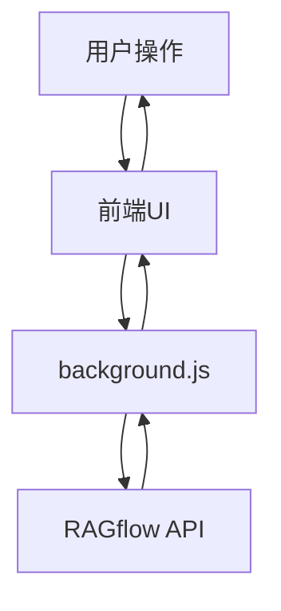

# AI Browser Extension Framework

## 1. 项目结构
```
AI-Browser-Extension/
├── extension/                 # 浏览器插件主目录
│   ├── manifest.json         # 插件配置文件
│   ├── popup/               # 弹出窗口相关文件
│   │   ├── index.html      # 弹出窗口HTML
│   │   ├── popup.js        # 弹出窗口逻辑
│   │   └── styles.css      # 弹出窗口样式
│   ├── background/         # 后台脚本
│   │   └── background.js   # 后台服务
│   ├── content/           # 内容脚本
│   │   └── content.js     # 页面内容处理脚本
│   └── assets/           # 静态资源
│       └── icons/        # 图标文件
└── Documents/            # 项目文档
    └── RAGFlow HTTP API.xml  # API文档
```

## 2. 核心功能模块

### 2.1 临时知识库管理模块
- 文件上传管理
  - 本地文件上传（PDF、TXT、DOCX）
  - 当前网页内容提取
  - 文件列表管理（锁定/解锁、删除）
  
### 2.2 RAGflow对话集成模块
- iframe嵌入RAGflow Chat界面
- 与RAGflow API交互

## 3. API集成
- RAGflow HTTP API接口调用
  - 文档上传接口
  - 文档删除接口
  - 对话接口

## 4. 用户界面
### 4.1 单Tab布局
- 上半部分：临时知识库管理
  - 功能按钮区
  - 文件列表显示区
- 下半部分：RAGflow Chat iframe

## 5. 数据流


## 6. 技术栈
- Frontend: HTML5, CSS3, JavaScript
- Browser Extension API
- RAGflow API Integration
